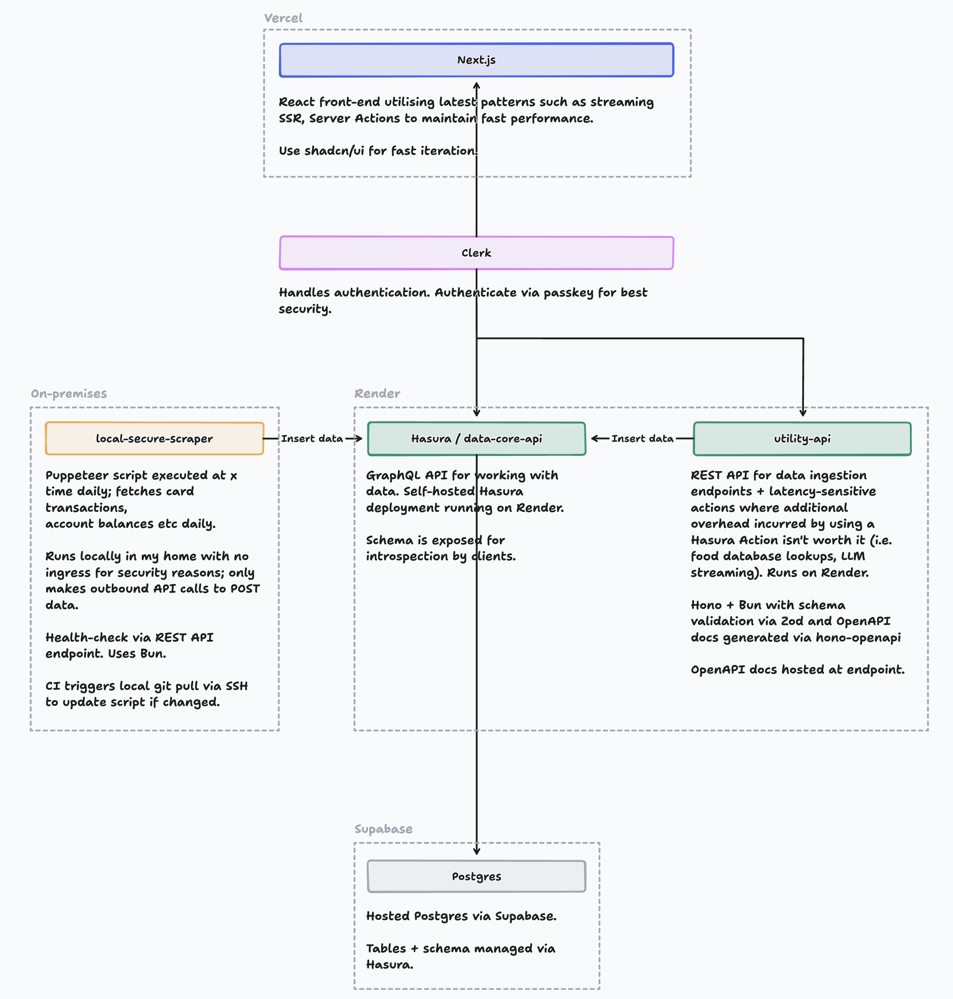

# Casa 🏡

Casa is my home for my life. It's a super-app with various features that replace popular apps, which I find to be lacking for my use-cases:

- Health: See all my health data in one place, including workouts, activity, sleep data and body metrics.
- Nutrition: Track and analyse what I eat quickly.
- Money: View and analyse my spending and savings, including card transactions and account balances.

At the core, it aims to centralise tracking all personal data, including but not limited to the following:

- Health: Workouts, steps, Apple Watch activity rings, calories burned, sleep data (time to fall asleep, time in stages, depth), weight, body composition
- Nutrition: Foods eaten, hydration tracking
- Finances: Account balances, debit/credit card transactions, ingoings/outgoings

The heart of Casa can be considered as a Postgres database, with a GraphQL data access layer sitting on top via Hasura as a self-hosted service. This allows me to query, manage and insert data in a flexible and programmatic manner. The front-end is simply an abstraction on top. Other micro-services are used for non-data use-cases such as data ingestion, scraping or latency-sensitive applications (i.e. streaming LLM response). All operations involving accessing sensitive data directly are executed in my home, such as scraping financial data.

## Architecture diagram

